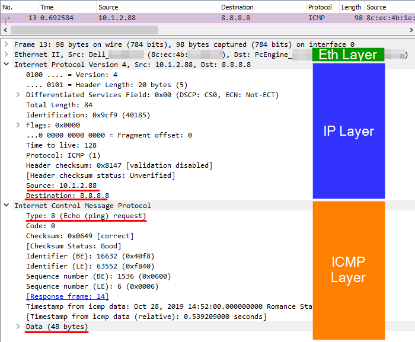

## Hacking networks

# with


---

<!-- .slide: style="text-align: left;" -->

### What's Scapy

_"Is a **Python program** that enables the user to **send**, **sniff**, **dissect**  and **forge network packets**"_

_"In other words, is a **powerful** interactive packet manipulation program"_

---

## Let's forge some packets

--



--

### Show me the code

```python
pkg = IP(dst="8.8.8.8")/ICMP(type=8)/"Payload Data"
pkg.show()
```

```python
###[ IP ]### 
    version= 4
    ihl= None
    tos= 0x0
    len= None
    id= 1
    flags= 
    frag= 0
    ttl= 64
    proto= icmp
    chksum= None
    src= 192.168.177.131
    dst= 8.8.8.8
    \options\
    ###[ ICMP ]### 
        type= echo-request
        code= 0
        chksum= None
        id= 0x0
        seq= 0x0
        ###[ Raw ]### 
            load= 'Payload Data'
```

---

## Let's send some packets

--

<!-- .slide: style="text-align: left;" -->

### Some types of send

#### **By layer**

* **Send in layer 3:** send, sr, sr1, srloop...
* **Send**p **in layer 2:** sendp, srp, srp1, srploop...

--

<!-- .slide: style="text-align: left;" -->

### Some types of send

#### **By behavior**

* **Just send some packages:** send, sendp...
* **Send some receive some:** sr srp, srloop, srploop...
* **Send some receive first:** sr1, srp1...

--

### Now, show me the code

```python
pkg = IP(dst="8.8.8.8")/ICMP(type=8)/"Payload Data"
rec = sr1(pkg)
rec.show()
```

```python
###[ IP ]###
    version= 4
    ihl= 5
    tos= 0x0
    len= 40
    id= 25657
    flags= 
    frag= 0
    ttl= 128
    proto= icmp
    chksum= 0x5460
    src= 8.8.8.8
    dst= 192.168.177.131
    \options\
    ###[ ICMP ]###
        type= echo-reply
        code= 0
        chksum= 0xa9ed
        id= 0x0
        seq= 0x0
    ###[ Raw ]###
            load= 'Payload Data'
    ###[ Padding ]###
                load= '\x00\x00\x00\x00\x00\x00'
```
